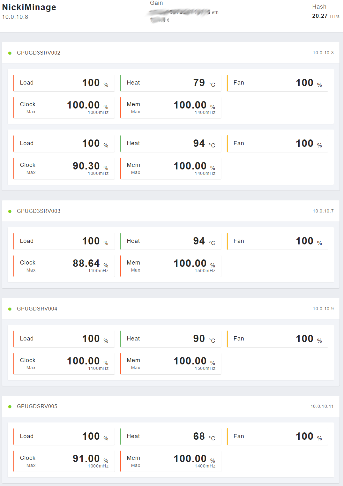
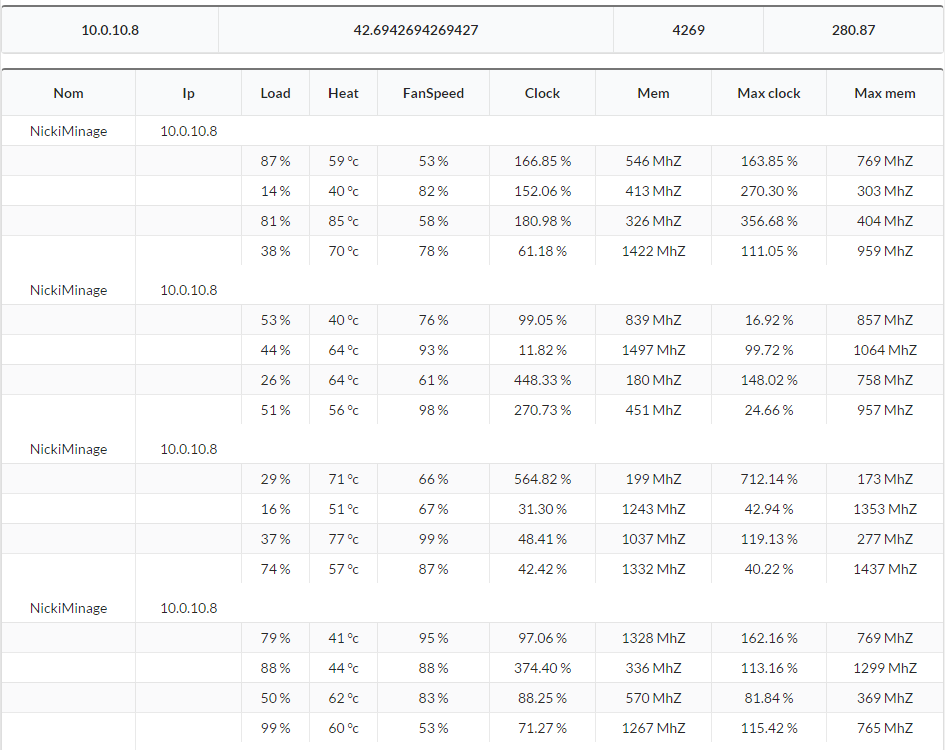

# Ethereum Dashoard

## Installation

> You can use the [install.sh](https://github.com/CamTosh/Ethereum/blob/master/serveur/install.sh) for the installation of miner(s) and master(s) 


# Configuration

The configuration file is client/config.json.
Just add, edit or delete address(es). You don't have to specify the protocol putting ```http://``` at the begin but you must define the port.

The address(es) on ```Master``` are for geth.py and these on ```Worker``` for gpu.py.


# Screenshots






# Memo

It's just a dashboard! You must install [Geth](https://github.com/ethereum/go-ethereum) and [Ethminer](https://github.com/ethereum-mining/ethminer).

Then you must run them: 

### Geth
```
# Geth --rpc --rpcaddr 127.0.0.1 --rpcport 8008 console
```

### Ethminer

```
# ethminer -F 127.0.0.1:8008 <your options>
```

### gpu.py

It needs [aticonfig](https://wiki.debian.org/ATIProprietary/Configuration)

Run as root:
```
# apt-get install -y python3 python3-pip
# python3 -m pip install subprocess locale requests bottle json socket netifaces datetime
# python3 gpu.py
```

### geth.py

It needs [geth](https://github.com/ethereum/go-ethereum/releases)

Run as root:
```
# apt-get install -y python3 python3-pip
# python3 -m pip install eth_rpc_client subprocess requests bottle netifaces json socket datetime
# python3 geth.py
```


## Usage:

Open the browser and go on MinerIPAddr:6969 (for gpu.py) or MinerIPAddr:4269 (for geth.py)

If you are using gpu.py, you should read something like this:
```
{
	data: {
		Uptime: "9 days, 3:53:44.990000",
		Ip: "10.0.10.3",
		Name: "GPUGD3SRV002",
		gpu: [
			{
				MaxMem: "1400",
				CurrentMem: "1400",
				Heat: "76",
				Load: "100",
				CurrentClock: "1000",
				Information: " Adapter 0 - Supported device 67B1 Core (MHz) Memory (MHz) Current Clocks : 1000 1400 Current Peak : 1000 1400 Configurable Peak Range : [300-1500] [150-2000] GPU load : 100% ",
				FanSpeed: "100",
				MaxClock: "1000"
			},
			{
				MaxMem: "1400",
				CurrentMem: "1400",
				Heat: "94",
				Load: "100",
				CurrentClock: "1000",
				Information: " Adapter 1 - Supported device 67B1 Core (MHz) Memory (MHz) Current Clocks : 884 1400 Current Peak : 1000 1400 Configurable Peak Range : [300-1500] [150-2000] GPU load : 100% ",
				FanSpeed: "100",
				MaxClock: "1000"
			}
		]
	}
}
```

Instead, if you are running geth.py, you should read something like this:

```
{
	data: [
		{
			Balance: 42694269426942694269,
			Uptime: "10 days, 4:21:40.910000",
			Euro: "4269",
			Ip: "10.0.10.8",
			Name: "NickiMinage",
			Hash: 280870704
		}
	]
}
```


## Server API:

## gpu.py

- Class: GPUinfo

	- getLoad: return GPU load
	- getTemperature: return GPU temperature
	- getFanspeed: return the GPU's fan speed
	- getMaxClock: return the GPU's graphics clock limit
	- getCurrentClock: return the GPU's graphics clock
	- getMaxMem: return the GPU's memory clock limit
	- getCurrentMem: return the GPU's memory clock
	- getInformation: return ```aticonfig --odgc``` output
	- get_adapter: return the number of graphics card recognized by aticonfig

- get_uptime: return miner uptime (not mining software uptime!)
- get_name: return miner hostname
- get_ip: return miner IP (eth0)

## geth.py

- Class : RpcJson

	- json: return the output of Geth's API
	- getEuroBalance: return the balance in €
	- getHashrate: return the hashrate
	- getBalance: return the wallet's balance
	- getAccounts: return the wallet's address

- get_uptime: return miner uptime (not mining software uptime!)
- get_name: return miner hostname
- get_ip: return miner IP (eth0)

# Buy me a :beer:

Do you like this repo? Are you using it on your miners? Do you have any idea to improve this repo? Let me know: tochecamille@gmail.com :)

Ethereum: 0xB3773eDC6540e6486897E2B6bA6BfA933793aDF6

[Paypal](https://www.paypal.me/CamTosh)
