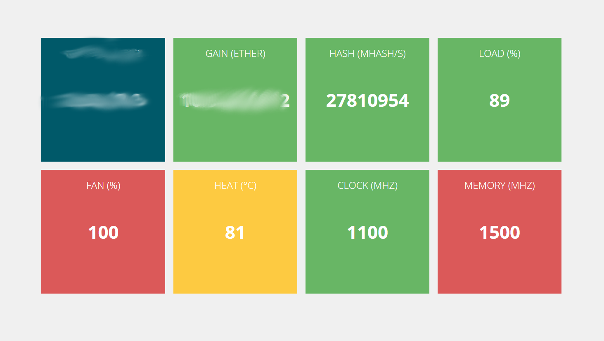

# Quelques commandes : 

## Sur le serveur : 
```
geth --rpc --rpcaddr adresseIpDeVotreServeur --rpcport lePort console
```
Lance le serveur Geth avec un accés console.

## Sur les machines :

```
ethminer -G --opencl-device 0,1,2,3 --no-precompute -F ip:portDuServeurGeth
```
Lance ethminer sur les 4 cartes graphiques sur le serveur Geth.

# API

> python3 api.py

## Require

- Python 3
	- eth_rpc_client 
	- subprocess
	- locale
	- re
	- requests
	- sys
	- os
	- bottle
	- json
	- socket
	- netifaces

## Exemple Json

```Json
{
	Ip: "10.42.69.42",
	Hash: 27295937,
	Balance: 42694269420000000000,
	Name: "MiningRig001",
	CurrentClock: "1100",
	MaxClock: "1100",
	MaxMem: "1500",
	Heat: "73",
	Load: "99",
	FanSpeed: "100",
	CurrentMem: "1500",
	Information: " Adapter 0 - Supported device 67B1 Core (MHz) Memory (MHz) Current Clocks : 1100 1500 Current Peak : 1100 1500 Configurable Peak Range : [300-1500] [150-2000] GPU load : 97% "
}
```