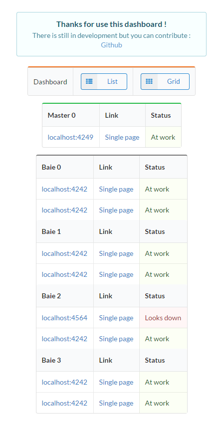

# Ethereum Dashoard

## Installation

> You can use the [install.sh](https://github.com/CamTosh/Ethereum/blob/master/serveur/install.sh) for the installation of miner(s) and master(s) 


# Configuration

La configuration se passe dans le fichier client/config.json.
Il suffit de modifier, ajouter ou supprimer des IP. Pas besoin de spécifier le protocol HTTP mais il faut impérativement mettre le port. 

Le/les serveurs dans ```Master``` sont pour Geth.py et ceux dans ```Worker``` pour Gpu.py. 

# Buy me a :beer:

Vous aimez mon travail ? Vous utilisez mon travail sur votre infrastructure ? Vous avez des idées d'ajout, de modification ? Faites le moi savoir : ctoche@pulseheberg.com :)

Ethereum : 0xB3773eDC6540e6486897E2B6bA6BfA933793aDF6

[Paypal](https://www.paypal.me/CamTosh) 

# Images





# Mémo

Les serveurs tournent sur [Ubuntu 14.04](http://cdimage.ubuntu.com/netboot/14.04/), il faut activer le pilote graphique propriétaire d'ATI pour le bon fonctionnement. Les cartes graphiques sont des r9 290.

> Installation geth, ethereum et ethminer : 

```
λ bash <(curl https://install-geth.ethereum.org -L)
λ bash <(curl https://install-eth.ethereum.org -L)
λ apt-get install ethminer
```

> Lancement des logiciels : 

```
λ Geth --rpc--rpcaddr ipDuServeurGeth --rpcport 8008 console
```

```
λ ethminer -G --opencl-device 0,1,2,3 --no-precompute -F ipDuServeurGeth:8008
```

Il ce peut que les toutes les cartes graphiques ne soient pas utilisées, dans ce cas il faut lancer dans des terminaux différents.

L'argument ```--opencl-device``` (suivit d'un chiffre correspondant au numéro de la carte graphique) permet de choisir sur quelle(s) carte(s) graphique le minage se lancera.

Par exemple pour miner avec la seconde carte graphique :

```
λ ethminer -G --opencl-device 1 --no-precompute -F ipDuServeurGeth:8008
```

## Overclock

Mes réglages pour l'overclocking des cartes graphiques : 

[Page utile](https://wiki.archlinux.org/index.php/AMD_Catalyst#GPU.2FMem_frequency.2C_Temperature.2C_Fan_speed.2C_Overclocking_utilities)

> Passage de la vitesse des ventilateurs de 0 à 100% sur toutes les cartes graphiques : 

```
λ aticonfig --pplib-cmd "set fanspeed 0 100" --adapter=all
```
> Activation de la possibilité d'overclocking sur toutes les cartes graphiques : 

```
λ aticonfig --od-enable --adapter=all
```

> Augmentation de la vitesse d'horloge à 1100 ainsi que la vitesse de la mémoire à 1400 sur toutes les cartes graphiques : 

```
λ amdconfig --odsc=1100,1400 --adapter=all
```

**Attention, des erreurs peuvent survenir, à manipuler avec attention. Les capacitées d'overclockings peuvent varier suivant les cartes, l'alimentation ou encore la chaleur.**

### gpu.py

Nécéssite [aticonfig](https://doc.ubuntu-fr.org/aticonfig)

```
λ apt-get install -y python3 python3-pip
λ python3 -m pip install subprocess locale requests bottle json socket netifaces datetime
λ python3 gpu.py
```

### geth.py

Nécéssite [geth](https://github.com/ethereum/go-ethereum/releases)

```
λ apt-get install -y python3 python3-pip
λ python3 -m pip install eth_rpc_client subprocess requests bottle netifaces json socket datetime
λ python3 geth.py
```
